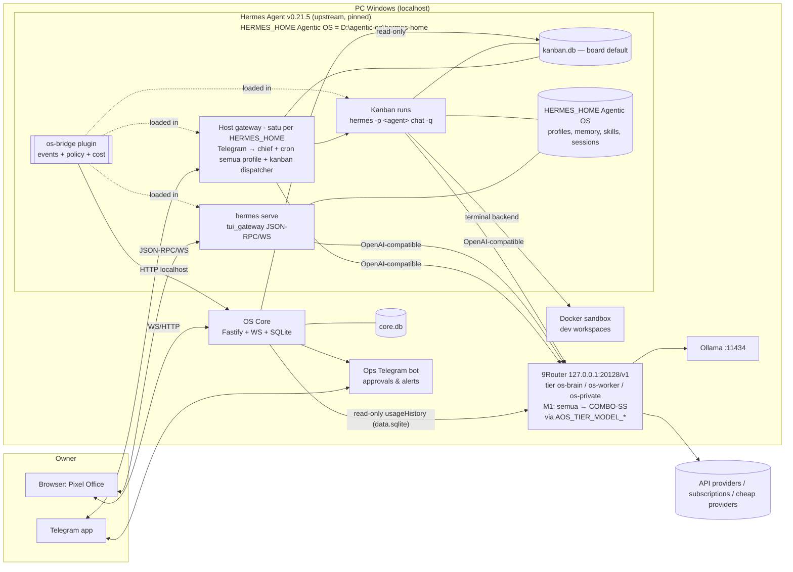

# Product Requirement Document (PRD)
## Project: Agentic OS (placeholder name) — Personal AI Office on Hermes + 9Router + Pixel Agents

| Field | Value |
|---|---|
| Status | Draft v1.1 — disinkronkan dengan hasil M1 (2026-10-01) |
| Owner | Single owner (personal, self-hosted) |
| Tanggal | 2026-09-30 |
| Decision log | [`grill-decisions.md`](grill-decisions.md) |
| Target platform F1 | Windows 11 native, localhost |

> **Konvensi:** asumsi teknis tentang komponen upstream (nama tool, key config, path) sudah diverifikasi di Milestone M1 pada mesin owner (Hermes Agent v0.21.5, 9Router 0.5.86); jawabannya ada di [`runbook.md`](runbook.md) §1 (baris V1–V16). Hanya item di §16 yang masih terbuka.

---

## 1. Executive Summary

### 1.1 Visi
Sebuah "kantor AI" pribadi: lima agent spesialis yang bekerja 24/7 (selama PC menyala), masing-masing punya memory dan skill sendiri, berkoordinasi lewat satu task board, dan **terlihat** bekerja sebagai karakter pixel-art di sebuah kantor virtual. Owner berperan sebagai "CEO": memberi brief lewat Telegram atau chat di kantor pixel, menyetujui aksi berisiko, dan memantau biaya.

### 1.2 Masalah yang diselesaikan
1. **Agent tunggal tidak skalabel secara mental** — satu chat untuk semua urusan membuat konteks bercampur. Peran terpisah dengan memory terpisah lebih mudah dipercaya dan di-debug.
2. **Agent otonom itu "kotak hitam"** — tidak jelas siapa sedang mengerjakan apa, apa yang macet, dan berapa biayanya. Pixel office menjadikan state agent bisa dilihat sekilas.
3. **Model & biaya tersebar** — banyak akun (API berbayar, langganan, provider murah, model lokal). 9Router menyatukannya di satu endpoint dengan fallback.
4. **Otonomi tanpa rem itu berbahaya** — aksi keluar (kirim pesan, posting, push, hapus) harus ditahan di level tool, bukan sekadar instruksi prompt.

### 1.3 Goals (F1)
- G1. Lima agent (Hermes profile) aktif, dengan `chief` sebagai pintu masuk via Telegram.
- G2. Delegasi berbasis kanban bawaan Hermes, berjalan otomatis untuk tugas berisiko rendah.
- G3. Approval wajib untuk aksi eksternal/irreversible, ditegakkan di hook `pre_tool_call` (fail-closed).
- G4. Pixel office sebagai UI utama: kanvas + chat + kanban + approval + biaya.
- G5. Semua panggilan LLM lewat 9Router dengan 3 tier combo; semua token tercatat per agent/kartu.
- G6. Personal Assistant harian: briefing pagi, reminder, capture tugas dari chat.

### 1.4 Non-Goals (F1)
- Multi-user / multi-tenant / SaaS, billing.
- Akses dari internet publik (hanya localhost; HP via Telegram).
- Layout mobile untuk pixel office.
- Gmail, Google Calendar, WhatsApp (→ F2).
- Publish ke sosial media via postit (→ F2).
- Coding agent dengan hak push/deploy tanpa approval (→ F3 untuk otonomi lebih luas).
- Fork Hermes Agent atau Hermes Desktop.
- Hard budget limit (keputusan #8: monitoring + notifikasi saja).
- Lisensi komersial untuk asset pixel pihak ketiga.

---

## 2. Persona & Use Cases

### 2.1 Persona tunggal: Owner
Developer/entrepreneur solo, memakai Windows, nyaman dengan terminal dan monorepo TypeScript, sudah membangun `postit` (clone Postiz). Punya API key berbayar, beberapa langganan AI, akses provider murah, dan GPU untuk model lokal. Ingin "tim" AI yang bisa diberi tugas dan dipantau, bukan chatbot tambahan.

### 2.2 Roster agent F1

| Profile | Peran | Tier 9Router | Kanal | Toolset utama | Catatan |
|---|---|---|---|---|---|
| `chief` | Chief of Staff / orchestrator / PA front-desk | `os-brain` | Telegram + office | `office_create_task` / `office_list_tasks` (plugin), memory, cron, web search ringan | Satu-satunya yang terhubung ke Telegram; pengiriman keluar lewat delivery gateway/cron (tidak ada tool `send_message`) |
| `researcher` | Riset web, ringkasan, perbandingan | `os-worker` | office | web search, browser, file write di workspace | Output = dokumen di workspace kartu |
| `secretary` | Reminder, catatan, kerapian kanban, jadwal | `os-private` | office | cron, memory, kanban (update), notes | Menyentuh data pribadi → tier private |
| `content` | Riset tren, ide & draft konten | `os-worker` | office | web search, file write | F1: draft saja. F2: MCP postit |
| `dev` | Baca/ubah kode, jalankan tes | `os-brain` | office | terminal (Docker sandbox), file ops, git (push = approval) | Sandbox wajib (§8.4) |

### 2.3 User stories utama (F1)

**Personal Assistant**
- US-01. Sebagai owner, saya menerima **briefing pagi** di Telegram pukul 07:00 berisi: kartu hari ini per agent, kartu `blocked`/menunggu approval, biaya kemarin per tier, dan topik/berita pilihan.
- US-02. Saya bisa menulis "ingatkan aku bayar listrik Jumat jam 9" di Telegram → `secretary` membuat reminder, dan saya menerima notifikasi pada waktunya.
- US-03. Saya bisa melempar ide/tugas mentah ke `chief` ("riset 5 kompetitor postiz, bikin tabel") → muncul sebagai kartu kanban ter-assign ke agent yang tepat.
- US-04. Jika PC mati saat jadwal briefing, briefing dikirim saat PC menyala kembali (jika masih sebelum 12:00), ditandai "terlambat".

**Kantor & delegasi**
- US-05. Brief ke `chief` dipecah jadi ≥1 kartu dengan acceptance criteria; kartu berisiko rendah langsung `ready`.
- US-06. Saya melihat di kanvas siapa sedang bekerja (animasi mengetik/membaca/menjalankan perintah) dan siapa menunggu saya (balon "!").
- US-07. Klik karakter → dock kanan menampilkan chat dengan agent itu, kartu aktifnya, dan log tool live.
- US-08. Saya bisa drag kartu antar kolom di laci kanban (mis. `blocked` → `ready` setelah memberi instruksi tambahan).

**Approval & keamanan**
- US-09. Saat agent mencoba aksi berisiko, saya mendapat permintaan approval berisi: agent, kartu, tool, argumen (ringkas + detail), alasan agent — dengan tombol Approve / Deny / Deny+Instruksi, di Telegram maupun office.
- US-10. Tidak ada aksi berisiko yang tereksekusi tanpa approval, bahkan jika halaman web yang dibaca agent berisi instruksi jahat (prompt injection).

**Biaya**
- US-11. Saya melihat biaya hari ini secara live di HUD, dan rincian per agent/kartu/tier.
- US-12. Saya diberi tahu jika satu kartu mengonsumsi token jauh di atas normal, dan kartu itu dihentikan otomatis (circuit breaker).

---

## 3. Scope & Phasing

| Fase | Isi | Prasyarat |
|---|---|---|
| **F1 — Core + PA** | Hermes 5 profile, 9Router 3 combo, os-bridge (event + policy + cost), OS Core, pixel office (kanvas + dock + HUD + kanban + chat), Telegram, cron briefing/reminder, Docker sandbox `dev` | PC Windows, Docker Desktop, Ollama (opsional) |
| **F2 — Content & Always-on** | MCP postit untuk `content` (draft otomatis, schedule/publish = approval); postit AI → 9Router; WhatsApp (Baileys nomor khusus vs Cloud API); Gmail/Calendar read-only; opsi pindah backend ke VPS/mini-PC + Tailscale; papan jadwal postit di dinding office | F1 lulus gate |
| **F3 — Dev autonomy** | Workflow PR penuh (branch → test → PR → review), CI integration, kebijakan approval yang lebih granular untuk `dev` | F2 stabil |

---

## 4. Arsitektur Sistem

### 4.1 Diagram tingkat tinggi



### 4.2 Tanggung jawab komponen

| Komponen | Tanggung jawab | Bukan tanggung jawab |
|---|---|---|
| **Hermes (upstream)** | Agent loop, memory, skills, profile, **satu host gateway per `HERMES_HOME`** (melayani Telegram → `chief`, dispatcher kanban, dan cron untuk semua profile), `hermes serve` untuk chat interaktif, terminal backend Docker | UI kantor, approval lintas-kanal, ledger biaya |
| **os-bridge (plugin Python)** | Memancarkan event lifecycle/tool/LLM ke Core; policy engine di `pre_tool_call`; menunggu/menolak approval; circuit breaker lokal (usage token **tidak** dari `post_llm_call` — lihat §5.3.1) | Menyimpan state jangka panjang (itu Core) |
| **OS Core (Node)** | Event store, approval service + token, cost ledger (sumber token usage: `usageHistory` 9Router), snapshot kanban (read-only), WebSocket fan-out ke UI, notifikasi Telegram (bot utama, `sendMessage`), deteksi briefing terlewat, health check | Menjalankan agent, mengubah kanban secara langsung di SQLite |
| **9Router** | Routing OpenAI-compatible ke semua provider; combo/fallback; key rotation; quota; usage (disimpan di `data.sqlite`, tabel `usageHistory`) | Kebijakan approval |
| **Pixel Office (React)** | Kanvas pixel, dock chat (client `tui_gateway`), laci kanban, approval inbox, HUD biaya, layout editor | Logika bisnis (semua via Core/Hermes) |

### 4.3 Keputusan arsitektur penting (ADR ringkas)

1. **ADR-01 Tidak fork Hermes.** Semua ekstensi via plugin (per profile: `<HERMES_HOME>\profiles\<profile>\plugins\<nama>\`, diaktifkan dengan `hermes -p <profile> plugins enable <nama>`) dan API publik (`tui_gateway`). Versi Hermes **di-pin**; upgrade hanya setelah contract test lulus (§12). Agentic OS memakai `HERMES_HOME` sendiri (`D:\agentic-os\hermes-home`) berdampingan dengan instalasi Hermes owner (`%LOCALAPPDATA%\hermes`): **source checkout dipakai bersama, venv terpisah**; satu **host gateway per `HERMES_HOME`** (multiplex Hermes v0.21.5) melayani Telegram → `chief`, dispatcher kanban, dan cron semua profile, bukan gateway khusus `chief`.
2. **ADR-02 Kanban Hermes = sumber kebenaran task.** Core **tidak menulis** langsung ke SQLite kanban. Mutasi kartu (pindah kolom, re-queue setelah approval) dilakukan lewat CLI resmi Hermes: `hermes kanban create "<title>" --assignee <p> --body … --workspace dir:<abs>`, `list`, `show <id>`, `assign`, `complete`, `block`, `unblock`, `archive` (`show` tidak punya `--json`; outputnya teks `status: …`).
3. **ADR-03 Satu bot Telegram, approval lewat chief (direvisi M3, keputusan owner 2026-10-02).** Bot utama dimiliki **host gateway Agentic OS** (profile `chief`; konfigurasi Telegram di `profiles\chief\.env`). Approval memakai **chief + tombol approve bawaan Hermes**: owner membalas "setujui/tolak <id>", chief memanggil `office_approve`, dan tool itu sendiri dijaga gate Hermes sehingga setiap persetujuan butuh tombol dari owner. Notifikasi & alert Core dikirim lewat `sendMessage` bot yang sama (kirim pesan tidak bentrok dengan polling gateway). Ops bot kedua ditunda (opsional F2).
4. **ADR-04 Fail-closed.** Jika Core tidak dapat dihubungi, os-bridge **menolak** semua tool berisiko (tool non-berisiko tetap jalan). Event di-buffer lokal (file JSONL) dan dikirim ulang saat Core kembali.
5. **ADR-05 Tier, bukan model.** Profile Hermes hanya mengenal nama combo (`os-brain`/`os-worker`/`os-private`). Tier dipetakan ke nama model 9Router lewat `AOS_TIER_MODEL_OS_BRAIN|OS_WORKER|OS_PRIVATE` (saat ini semuanya `COMBO-SS`, lihat §5.2); penggantian model dilakukan di 9Router. Toolset/model tidak diganti di tengah percakapan (menjaga prompt cache Hermes).
6. **ADR-06 Chat UI = client `tui_gateway`.** Pixel office memakai ulang paket client `apps/shared` Hermes (MIT). `@hermes/shared` adalah paket **private** yang mengekspor source TS langsung (`./src/index.ts`), jadi di M5 di-vendor/di-link sebagai path, bukan install npm.

### 4.4 Alur utama

**A. Chat interaktif (office → agent)**
1. Owner klik karakter `researcher` → dock membuka sesi via `tui_gateway` (profile `researcher`).
2. Token & tool activity di-stream langsung dari `hermes serve` ke dock.
3. os-bridge (dimuat di proses serve) mengirim event `tool.started/finished` ke Core → Core broadcast ke kanvas → karakter beranimasi.

**B. Delegasi via Telegram**
1. Owner: "riset 5 kompetitor postiz" → host gateway Agentic OS → `chief`.
2. `chief` membuat kartu kanban lewat tool plugin `office_create_task` (assignee `researcher`, status `ready`, acceptance criteria). Tool `kanban_*` bawaan Hermes **hanya aktif di dalam worker yang di-spawn dispatcher**, bukan untuk `chief`. Tiap kartu mendapat workspace permanen `dir:` (`D:\agentic-os\hermes-home\workspaces\<stamp>-<slug>\`; root dikunci ke `HERMES_HOME` Agentic OS oleh plugin) tempat hasil kerja worker tersimpan. Kartu smoke awal M1 ada di `…\profiles\chief\workspaces\` (dibuat sebelum pengunciran ini).
3. Dispatcher (tick 60 dtk, `max_in_progress` 2, sesuai config root; §5.1.3) menjalankan `hermes -p researcher chat -q <prompt>` dengan env `HERMES_KANBAN_TASK`, `HERMES_KANBAN_WORKSPACE`.
4. os-bridge di proses run → event `session.started`, `session.ended`, `llm.started`, `llm.finished`, `tool.started`, `tool.finished` ke Core (dengan `task_id`). Bridge tidak mengirim `run.started` maupun `llm.usage`; usage/biaya berasal dari `usageHistory` 9Router.
5. Selesai → kartu `done`; `chief` dapat merangkum hasil ke Telegram utama.

**C. Approval — sesi interaktif/gateway/cron (terpasang M3)**
1. `pre_tool_call` di os-bridge mencocokkan policy → aksi `approve`.
2. os-bridge mengembalikan directive `{"action":"approve","message","rule_key"}` → gate approval bawaan Hermes: Telegram menampilkan tombol Allow Once/Session/Always/Deny, CLI menampilkan prompt, cron & `chat -q` menolak (`approvals.cron_mode` / `single_query_mode: deny`). Timeout 10 menit (`approvals.timeout: 600`) = ditolak.
3. Hasilnya tercatat di Core sebagai baris approval `mode=native` (dari event `tool.started` + `tool.finished`).

**D. Approval — mode background (kanban run, terpasang M3)**
1. `pre_tool_call` → aksi `approve` → os-bridge `POST /v1/approvals/consume`; tidak ada grant → `POST /v1/approvals` (park) → tool ditolak dengan `PENDING_APPROVAL:<id>`. Persona menyuruh worker memanggil `kanban_block` (`awaiting_approval:<id>`, kind `needs_input`) dan berhenti rapi.
2. Core mengirim notifikasi Telegram "🔐 Izin diminta: <id>" (id 6 karakter).
3. Owner membalas ke chief "setujui <id>" (lalu menekan tombol konfirmasi Hermes) atau "tolak <id> <alasan>" → `office_approve` → `POST /v1/approvals/:id/decision`. Persetujuan = **grant sekali pakai** terikat `(task_id, tool, args_hash)`, berlaku 24 jam.
4. Core melihat kartu `blocked` → `hermes kanban unblock --reason "approved:<id> …"` (atau `DENIED_BY_OWNER:<id> …`) → kartu `ready`.
5. Run ulang: grant cocok → dikonsumsi atomik → tool jalan. Args berbeda → approval baru. Ditolak → `DENIED_BY_OWNER` dengan instruksi owner.

**E. Biaya**
1. `post_llm_call` **tidak membawa token usage** (hanya teks & history), jadi usage tidak diambil dari hook. Core membaca tabel `usageHistory` di `%APPDATA%\9router\db\data.sqlite` (read-only; kolom `timestamp, provider, model, connectionId, apiKey, endpoint, promptTokens, completionTokens, cost, status, tokens, meta`) dan menulis event `llm.usage` (profile, combo, model aktual, token in/out/cache).
2. Kolom `apiKey` (berisi key mentah — **tidak pernah ditampilkan** di Core/office/log) saat ini **tidak bisa membedakan profile atau task**: kelima profile memakai SATU key 9Router ("HERMES"), sehingga `apiKey` hanya memisahkan trafik Hermes dari aplikasi lain. Atribusi biaya per profile butuh salah satu dari dua opsi: (a) satu key 9Router per profile (perubahan `apply-profiles`), lalu cocokkan `apiKey` persis (exact match) di memori terhadap nilai `AOS_ROUTER_KEY*` di `.env.local` (key tidak pernah disimpan, di-log, atau dikirim); atau (b) join berdasarkan jendela waktu + event task. Core menghitung biaya dari price table + rekonsiliasi harian dengan agregat 9Router `usageDaily`.

---

## 5. Spesifikasi Komponen

### 5.1 Hermes Layer

**5.1.1 Instalasi & versi**
- Instal memakai Hermes milik owner yang sudah ada (`install.ps1` / Hermes Desktop) di Windows native. Agentic OS memakai `HERMES_HOME` sendiri, `D:\agentic-os\hermes-home` (`AOS_HERMES_HOME`), berdampingan dengan instalasi owner di `%LOCALAPPDATA%\hermes`: runtime (venv) dipasang ulang di folder Agentic OS (~2,5 GB), **source checkout tetap dipakai bersama** di `%LOCALAPPDATA%\hermes\hermes-agent`.
- Pin = commit source bersama di `infra/hermes.lock` (M1: Hermes Agent v0.21.5, `e85706c`); `doctor` membaca `Install directory` dari `hermes --version`. Update Hermes Desktop menggeser commit ini: `doctor` FAIL `hermes-pin` = sinyal untuk uji ulang lalu bump lock (PR tersendiri + contract test, §12). Jangan menjalankan `hermes update` dari folder Agentic OS.

**5.1.2 Profile**
- 5 profile: `chief`, `researcher`, `secretary`, `content`, `dev` (`hermes -p <name>`), masing-masing punya config, memory, skills, sessions sendiri.
- Tiap profile punya **persona file** (SOUL/system prompt) yang berisi: peran, batasan, format output, aturan eskalasi, dan aturan menangani `PENDING_APPROVAL` / `DENIED_BY_OWNER`.
- Provider model tiap profile (custom OpenAI-compatible): `model: {provider: custom, base_url: http://127.0.0.1:20128/v1, default: <model 9Router>, key_env: OPENAI_API_KEY}`. Nama model per tier diatur lewat `AOS_TIER_MODEL_OS_BRAIN|OS_WORKER|OS_PRIVATE` di `.env.local` (saat ini semuanya `COMBO-SS`; lihat §5.2). Panggilan auxiliary (`title_generation`, compression, vision auto-detect) juga memakai provider utama ini, jadi ikut lewat 9Router.
- Plugin per profile, bukan global: `<HERMES_HOME>\profiles\<profile>\plugins\<nama>\`; tool dimuat lazy lewat tool search, jadi persona harus menyebut nama tool secara eksplisit (mis. `office_create_task`).

**5.1.3 Gateway & Telegram**
- Satu **host gateway per `HERMES_HOME`** (multiplex Hermes v0.21.5) melayani Telegram → `chief`, dispatcher kanban, dan cron semua profile. Autostart lewat `shell:startup\Hermes_Gateway_787a7c01.vbs` (Startup folder, tanpa UAC). Gateway dan data Hermes lama milik owner berjalan berdampingan dan tidak disentuh.
- Hanya `chief` yang terhubung ke bot Telegram utama; konfigurasi Telegram (token, whitelist user ID owner) berada di `profiles\chief\.env`.
- Dispatcher berjalan di dalam host gateway ini; log di `D:\agentic-os\hermes-home\logs\gateway.log`.
- **Dispatcher & cron di config ROOT (M2, terverifikasi):** host gateway membaca dispatcher dan cron dari `D:\agentic-os\hermes-home\config.yaml`, yang ditulis `apply-profiles`: `kanban.dispatch_in_gateway: true`, interval 60 dtk, `dispatch_profiles` = kelima profile, `max_in_progress: 2`, `failure_limit: 2`; `cron.catch_up_missed: true`; model root → 9Router. `doctor` memeriksanya lewat `root:model`, `root:dispatcher`, `root:cron-catch-up`, dan `gateway-running`. Ini menggantikan keterbatasan M1 (batas dispatcher belum berlaku).
- **Sandbox worker (M2):** profile memakai `terminal.container_persistent: true` + `docker_persist_across_processes: false`, sehingga tiap proses worker yang di-spawn dispatcher mendapat container sendiri dengan workspace kartu ter-mount di `/workspace`; file hasil worker (mis. `notes.md`) tersimpan per kartu dan tidak ada container `hermes-*` tersisa setelah run.

**5.1.4 Cron (profile-scoped)**

| Job | Profile | Jadwal default | Output |
|---|---|---|---|
| Morning briefing | `chief` | 07:00 setiap hari | Pesan Telegram (§5.5.6 format) |
| Reminder sweep | `secretary` | sesuai reminder | Pesan Telegram via `chief` |
| Board hygiene | `secretary` | 21:00 | Arsip kartu `done` >7 hari, flag kartu `blocked` >24 jam |
| Daily cost digest | Core (bukan Hermes) | 23:55 | Disertakan di briefing esok |

**5.1.5 Kanban**
- M1 memakai board **default** (`kanban.db` di `HERMES_HOME`, mode WAL, aman dibuka read-only saat gateway jalan); board `office` tidak dibuat. Status: `triage → todo → ready → running → blocked/review/done/archived`.
- Workspace: kartu dari `chief` memakai workspace permanen `dir:` di `D:\agentic-os\hermes-home\workspaces\<stamp>-<slug>\` (hasil kerja tersimpan); kartu manual tanpa `--workspace` memakai workspace *scratch* yang **dihapus saat kartu selesai**.
- Konvensi kartu (disimpan di body kartu, markdown): `Goal`, `Acceptance criteria`, `Inputs`, `Risk: low|external`, `Parent` (jika hasil pecahan brief).
- Label wajib: `agent:<profile>`, `source:telegram|office|cron`, `risk:low|external`.

### 5.2 9Router Layer

**5.2.1 Deployment**: 9Router 0.5.86 (`npm install -g 9router`), jalan di `127.0.0.1:20128`, dashboard di port yang sama. Autostart lewat launcher `shell:startup\9router.vbs` dengan `--tray --skip-update --host 127.0.0.1` (bind localhost saja; bukan Scheduled Task). **Require API key: ON** — melindungi `/v1/chat/completions` (`GET /v1/models` memang tetap publik); Hermes memakai key 9Router khusus ("HERMES"), aplikasi lain butuh key sendiri. Data di `%APPDATA%\9router\db\data.sqlite` (WAL). Semua panggilan LLM Agentic OS (agent, auxiliary) lewat endpoint ini.

**5.2.2 Combo**

| Combo | Dipakai oleh | Urutan fallback (contoh awal) | Aturan |
|---|---|---|---|
| `os-brain` | `chief`, `dev` | API key model frontier → API key alternatif → (langganan hanya jika sesi interaktif) | Kualitas utama; tidak boleh jatuh ke model lokal kecil |
| `os-worker` | `researcher`, `content` | provider murah (DeepSeek/Qwen/GLM/Kimi) → API key mid-tier | Volume tinggi, biaya rendah |
| `os-private` | `secretary` | Ollama lokal → API dengan zero-data-retention | Data pribadi; tidak boleh ke provider tanpa kebijakan retensi jelas |

> **Status M1:** combo `os-*` belum dibuat. Sementara **semua tier** (`os-brain`, `os-worker`, `os-private`) diarahkan ke satu combo `COMBO-SS` (model akun langganan konsumen) lewat `AOS_TIER_MODEL_*`. Tabel di atas adalah target, bukan kondisi terpasang; `os-private` belum lokal.

**5.2.3 Kebijakan langganan konsumen**: akun langganan (Claude/ChatGPT/Gemini/Copilot via OAuth) **tidak dimasukkan** ke combo yang dipakai kanban run/cron. Hanya boleh untuk combo interaktif terpisah (`os-brain-interactive`, opsional) — mitigasi risiko ToS/pembatasan akun. **Pengecualian M1:** `COMBO-SS` (model langganan konsumen) dipakai untuk semua tier termasuk kanban run/cron; pengecualian ini diterima owner dengan sadar akan risiko ToS/limit, dan harus diganti setelah combo `os-*` / API key / Ollama tersedia (§16).

**5.2.4 Kebutuhan**: timeout & retry di 9Router harus lebih pendek dari timeout tool Hermes; kegagalan seluruh fallback → error jelas ke agent (bukan hang).

### 5.3 os-bridge Plugin (Python)

**5.3.1 Hook yang dipakai**

| Hook | Tujuan |
|---|---|
| `on_session_start` / `on_session_end` | Event `session.started/ended` (profile, session_id, task_id dari env `HERMES_KANBAN_TASK` bila ada, mode `interactive|kanban|cron`) |
| `pre_llm_call` / `post_llm_call` | Event `llm.started` (→ animasi "berpikir") dan latency. **`post_llm_call` tidak membawa token usage** (hanya teks & history); event `llm.usage` diisi Core dari `usageHistory` 9Router (§4.4-E, §5.4.1) |
| `pre_auxiliary_call` / `post_auxiliary_call` | Event panggilan tambahan (titling, compression, vision); payload `pre_auxiliary_call`: `aux_task, model, provider, base_url, approx_input_tokens…`. Usage-nya ikut ledger lewat `usageHistory` |
| `pre_tool_call` | Policy check → allow / wait-approval / park / deny; event `tool.started` |
| `post_tool_call` | Event `tool.finished` (durasi, status, ringkasan hasil ter-redaksi) |

Kontrak hook (terverifikasi, runbook V6): semua hook dipanggil dengan **keyword-only args**. Field per hook:
- `pre_tool_call`: `tool_name`, `args` (dict), `task_id`, `session_id`, `tool_call_id`, `turn_id`, `api_request_id`.
- `post_tool_call`: field `pre_tool_call` + `result`, `duration_ms`, `status`, `error_type`, `error_message`.
- `on_session_start`: `session_id`, `model`, `platform`.
- Membatalkan tool: return `{'action': 'block', 'message': …}`; meminta persetujuan manusia lewat gate Hermes: return `{'action': 'approve', 'message': …, 'rule_key': …}` (block > approve). Exception di hook diabaikan Hermes (fail-open), jadi bridge menangkap semua error sendiri dan memblokir tool non-baca. Setelah block, `post_tool_call` tetap dipanggil dengan `status = "blocked"`.

**5.3.2 Deteksi mode**
- `kanban` jika env `HERMES_KANBAN_TASK` ada; `cron` jika dipicu scheduler — penanda terverifikasi (M2): sesi cron membawa `platform = "cron"` pada `on_session_start` (event session/llm `mode = cron`) dan `session_id = cron_<job_id>_<YYYYMMDD_HHMMSS>`; selain itu `interactive`.
- **Diperbaiki di M3:** bridge mengingat platform per `session_id` dari `on_session_start`, sehingga event `tool.*` membawa mode yang sama dengan event session/llm (`cli`/`telegram`/`cron`). Untuk policy, bridge membedakan `kanban` (env `HERMES_KANBAN_TASK`), `cron` (platform atau prefix `cron_`), dan `interactive`.

**5.3.3 Policy file** (terpasang M3: `infra/policy/policy.json` → `profiles\<profile>\plugins\os-bridge\policy.json` oleh `apply-profiles`, dengan `workspaces_root` diisi; JSON karena bridge stdlib-only. Dibaca saat sesi pertama di proses; perubahan berlaku setelah restart gateway.)

Aturan terpasang (deny > approve > allow; default allow): `payments` (deny; pola nama tool `*payment*`, `*purchase*`, `*checkout*`, `*pay_*` karena Hermes tidak punya tool tags), `workspace-injection` (deny `kanban_create` dengan `workspace_path` tidak berada di bawah root workspace), `workspace-kind` (deny workspace `worktree`), `execute-code-unattended` (deny di kanban/cron), `execute-code` (approve), `external-interaction` (browser_navigate/click/type/press/exec/cdp/dialog, computer_use), `git-push` (git push, `gh pr create|merge`, npm/pnpm/yarn publish), `delete` (rm, rmdir, unlink, Remove-Item, del, erase, git clean, `git reset --hard`, shred, `find -delete`, truncate), `network-egress` (curl, wget, nc, ssh, scp, rsync, ftp, telnet, Invoke-WebRequest, URL `http(s)://` di perintah, `python -c` / `node -e` dkk., `/dev/tcp/`), `write-outside-workspace` (write_file/patch di kanban ke luar workspace kartu), `cron-manage` (kecuali chief/secretary), `skill-manage`, `approve-decision-unattended` (deny `office_approve` di kanban/cron), `approve-decision` (approve `office_approve` dengan `decision=approve`). Rancangan awal (YAML) di bawah dipertahankan sebagai acuan:

```yaml
version: 1
default: allow            # tool tidak terdaftar = allow, kecuali cocok rule di bawah (nama tool aktual: runbook V2)
fail_mode: closed         # Core tak terjangkau → rule 'approve' diperlakukan sebagai 'deny'
rules:
  - id: external-interaction
    match: { tool: [browser_*, computer_use] }   # interaksi eksternal lewat browser / desktop
    action: approve
  - id: terminal-write
    match: { tool: [terminal, process_manage, execute_code] }
    unless: { profile: dev, command_matches: ["^(ls|cat|pwd|git (status|diff|log)|npm test|pnpm test)\\b"] }
    action: approve
  - id: git-push
    match: { tool: [terminal], command_matches: ["git push", "gh pr (create|merge)"] }
    action: approve
  - id: destructive-fs
    match: { tool: [terminal, process_manage, write_file, patch], path_outside: "${HERMES_KANBAN_WORKSPACE}" }
    action: approve
  - id: delete
    match: { command_matches: ["\\brm\\b", "Remove-Item", "del "] , tool: [terminal] }
    action: approve
  - id: payments
    match: { tool_tags: [payment, purchase] }
    action: deny                              # F1: tidak pernah
  - id: cron-create
    match: { tool: [cronjob_manage], op: [create, update] }
    unless: { profile: [secretary, chief] }
    action: approve
```

> Tidak ada tool `send_message` yang bisa dipanggil agent di Hermes v0.21.5: pengiriman keluar terjadi lewat delivery gateway/cron, bukan tool agent, sehingga tidak perlu rule per-tool. Nama tool aktual untuk policy (runbook V2): `terminal`, `process_manage`, `read_file`, `write_file`, `patch`, `search_files`, `web_search`, `web_extract`, `execute_code`, `delegate_task`, `cronjob_manage`, `memory`, `browser_*`, `computer_use`, `kanban_*`; plugin Agentic OS: `office_create_task`, `office_list_tasks`.

**5.3.4 Approval** (terpasang M3)
- Request park berisi: `profile`, `task_id`, `session_id`, `tool`, `args_preview` (disanitasi, ≤400 karakter), `args_hash` (sha256 argumen kanonik; untuk `terminal`/`process_manage`/`execute_code` = perintah dengan spasi dinormalkan), `reason` (alasan aturan), `rule_id`. Id 6 karakter (`abcdefghijkmnpqrstuvwxyz23456789`).
- Interaktif/gateway/cron: gate bawaan Hermes (bukan long-poll Core), timeout 10 menit = ditolak; `rule_key = aos:<rule_id>:<args_hash[:16]>` sehingga "Session/Always" hanya berlaku untuk perintah identik (untuk `office_approve`: hanya id itu).
- Background: `PENDING_APPROVAL:<id>` + grant sekali pakai saat run ulang (§4.4-D). Grant = baris approval `approved` yang dikonsumsi atomik menjadi `consumed` (tidak ada token rahasia yang dipindah antar proses); kedaluwarsa 24 jam. Permintaan `pending` > 24 jam → `expired` + notifikasi.
- Kode ke agent: `PENDING_APPROVAL:<id>`, `DENIED_BY_OWNER:<id>`, `DENIED_BY_POLICY:<rule>`, `DENIED_CORE_UNAVAILABLE:<rule>`, `CIRCUIT_OPEN`, `DENIED_POLICY_UNAVAILABLE`, `DENIED_BRIDGE_ERROR`, `UNKNOWN_APPROVAL:<id>`.
- Hermes wajib `approvals: {mode: manual, timeout: 600, cron_mode: deny, single_query_mode: deny, unattended_mode: deny}` di root & semua profile (`mode: off|smart` dan `HERMES_YOLO_MODE` mem-bypass gate); `doctor` memeriksanya.

**5.3.5 Circuit breaker** (lokal di plugin, dikonfirmasi Core; terpasang M3)
- Per sesi: jumlah tool call > 150 **atau** tool yang sama dengan args sama dipanggil >5× berturut-turut → semua tool berikutnya ditolak dengan `CIRCUIT_OPEN`, event `breaker.tripped`, Core memblokir kartu (`hermes kanban block <id> circuit_open: …`) dan mengirim alert Telegram.
- **Ditunda:** ambang token kumulatif (`max(10 × median token per run, 300k)`), karena hook tidak membawa usage dan key 9Router masih bersama (§16).
- Ambang dikonfigurasi di `policy.json` (`breaker.max_tool_calls`, `breaker.max_repeat`); ini **bukan** limit budget (keputusan #8).

**5.3.6 Reliability**
- Pengiriman event non-blocking (queue in-process + background thread), kecuali panggilan approval.
- Buffer offline: `%LOCALAPPDATA%\agentic-os\bridge-spool\*.jsonl`, dikirim ulang saat Core pulih (idempoten via `event_id` UUIDv7).
- Auth ke Core: shared secret dari env `AOS_BRIDGE_TOKEN`.

### 5.4 OS Core (Node + Fastify)

**Status M2 (terpasang):** `apps/core` = Fastify + WebSocket + **better-sqlite3** (penyimpangan sengaja dari rencana Drizzle; skema tetap seperti §6). Mendengarkan **hanya** `127.0.0.1:7400`; DB `D:\agentic-os\core\core.db`, log `D:\agentic-os\core\core.log`; autostart `shell:startup\AgenticOS_Core.vbs` (menjalankan `pnpm -F @aos/core start`; dipasang atas persetujuan owner). Membaca `kanban.db` (tiap 2 dtk) dan `data.sqlite` 9Router (tiap 30 dtk) secara read-only. Yang sudah ada di M2: ingest event, state agent, kanban-reader, ledger biaya, realtime WS. **M3:** approvals (store, grant, kedaluwarsa, baris native), kanban-actions (`hermes kanban unblock|block` lewat `execFile` dengan `HERMES_HOME` Agentic OS), notifikasi Telegram via bot utama, reaksi breaker, audit (`pnpm -F @aos/core risk-audit`). Modul catch-up mengikuti §13; ops-bot ditunda (ADR-03).

**5.4.1 Modul**

| Modul | Fungsi |
|---|---|
| `ingest` | `POST /v1/events` (batch), validasi Zod, simpan ke `events`, proyeksikan ke `agent_state` |
| `approvals` | CRUD approval, grant sekali pakai, kedaluwarsa 24 jam, baris `native` dari event, resume kartu (M3) |
| `kanban-reader` | Watch/poll `<HERMES_HOME>\kanban.db` (read-only, `mode=ro`; WAL aman dibaca saat gateway jalan), snapshot ke memori + diff yang di-broadcast ke topik `kanban` |
| `kanban-actions` | Mutasi kartu via CLI resmi `hermes kanban …` (child process, dengan `HERMES_HOME` Agentic OS), bukan tulis langsung ke DB |
| `costs` | Ledger dari tabel `usageHistory` 9Router (`data.sqlite`, dibuka read-only; baris dicocokkan persis (exact match) di memori terhadap nilai `AOS_ROUTER_KEY*` di `.env.local`; key tidak pernah disimpan, di-log, atau dikirim; **satu key bersama "HERMES" tidak membedakan profile/task → usage diatribusikan ke profile `shared` dan `byTask` kosong**; atribusi per profile/kartu aktif setelah key `AOS_ROUTER_KEY_<PROFILE>` dibuat, lihat §4.4-E dan §16) karena `post_llm_call` tak punya usage; price table, agregasi harian, rekonsiliasi dengan `usageDaily`, alert anomali |
| `realtime` | WebSocket `/v1/stream` → broadcast topik `events`, `agents`, `kanban`, `costs` ke office |
| `health` | Status Hermes gateway, `hermes serve`, 9Router, Ollama, Docker; tampil di HUD |
| `catchup` | Saat start: jika briefing hari ini belum terkirim dan jam < 12:00 → trigger cron briefing sekarang (label "terlambat") |
| `notify` | Notifikasi Telegram via bot utama: izin diminta/kedaluwarsa, breaker, kartu triage (M3); alert kesehatan & digest biaya menyusul. Ops bot kedua ditunda (ADR-03) |

**5.4.2 API (ringkas)**

| Method | Path | Pemanggil | Keterangan |
|---|---|---|---|
| POST | `/v1/events` | os-bridge | Batch event, idempoten; header `x-aos-bridge-token` (M2) |
| POST | `/v1/approvals` | os-bridge | Buat request `park` (dedupe per kartu+tool+args_hash) (M3) |
| POST | `/v1/approvals/consume` | os-bridge | Konsumsi grant `(task_id, tool, args_hash)` → `consumed` / `denied` / `none` (M3) |
| GET | `/v1/approvals/:id` | os-bridge atau owner | Detail request (M3) |
| GET | `/v1/approvals?status=` | office / chief | Daftar request (M3) |
| POST | `/v1/approvals/:id/decision` | office / chief (`office_approve`) | `approve` / `deny` + instruksi opsional (M3) |
| GET | `/v1/agents` | office | Roster + state terkini |
| GET | `/v1/kanban` | office | Snapshot board |
| POST | `/v1/kanban/:taskId/move` | office | Pindah kolom (via Hermes API resmi) |
| GET | `/v1/costs?since=&until=` | office | Agregasi biaya (default 24 jam terakhir; terpasang M2) |
| GET | `/v1/health` | publik (tanpa auth) | Status Core (terpasang M2) |
| GET / PUT | `/v1/office/state`, `/v1/office/state/:key` | office (UI) | Layout / kursi / setting kantor (`layout`, `seats`, `settings`) (M4) |
| GET | `/office/login?token=` | browser | Token UI valid → cookie httpOnly `aos_ui` → redirect `/office/` (M4) |
| GET | `/office/*` | publik | File statis build kantor (`apps/office/dist`), fallback `index.html` (M4) |
| WS | `/v1/stream` | office | Push realtime; topik `events`, `agents`, `kanban`, `costs` (terpasang M2) |

Rute UI (`/v1/agents`, `/v1/kanban`, `/v1/costs`, `/v1/stream`) di M2 memakai `Authorization: Bearer <AOS_UI_TOKEN>` atau `?token=`. Rute owner approval (list, decision) menerima `AOS_UI_TOKEN` atau `AOS_APPROVER_TOKEN` (dipasang hanya di plugin `aos-office-tools` chief). Ketiga token harus berbeda. Topik WS `approvals` ditambahkan di M3.

**5.4.3 Keamanan Core**
- Bind `127.0.0.1` saja. Auth: token bridge (header) & token UI (dibuat saat first-run, disimpan di cookie httpOnly untuk origin office). **M4:** cookie `aos_ui` (HttpOnly, SameSite=Strict, Path=/, 30 hari) dipasang lewat `/office/login`; rute UI menerima Bearer, `?token=`, atau cookie; JavaScript kantor tidak pernah memegang token.
- CORS hanya origin office.
- Payload approval & event disanitasi: mask pola secret (API key, token, password, nomor kartu).

### 5.5 Pixel Office (React 19 + Vite)

**5.5.1 Basis**: vendor engine Pixel Agents (MIT) — renderer Canvas 2D, state machine karakter, layout editor (JSON, hingga 64×64 tile), asset bawaan. Adapter VS Code / pembaca transcript JSONL dihapus dan diganti `HermesEventAdapter` (sumber: WS Core + stream `tui_gateway`).

**Terpasang M4 (2026-10-02):**
- UI Pixel Agents (`webview-ui` + `core/src`, commit `3537e14`, v1.4.1) di-vendor ke `apps/office/vendor/pixel-agents/` dengan 5 patch kecil (`NOTICE.md`).
- Transport bawaannya diganti `HermesTransport`: WS `/v1/stream` + REST Core, lalu `HermesAdapter` (`apps/office/src/hermes/`) menerjemahkan event, approval, dan state agent menjadi pesan Pixel Agents.
- Asset di-decode di browser; tidak ada server Pixel Agents.
- Core menyajikan build kantor di `http://127.0.0.1:7400/office/` (`pnpm aos office`). Layout, kursi, dan setting disimpan di tabel `office_state`.
- Sumber `tui_gateway` (chat) menyusul di M5.

**5.5.2 Layout layar (desktop-first, min 1280×720)**

```
┌──────────────────────────────────────────────┬──────────────────────┐
│                                              │  DOCK (kontekstual)  │
│              KANVAS KANTOR PIXEL             │  • Header agent      │
│   [chief]   [researcher]  [secretary]        │  • Chat (tui_gateway)│
│   [content]      [dev]      ☕ pantry         │  • Kartu aktif       │
│                                              │  • Log tool live     │
├──────────────────────────────────────────────┴──────────────────────┤
│ HUD: ⚠ Approval (2) │ $ hari ini 1.84 │ ▤ Kanban │ ● Health │ Ctrl+K  │
└──────────────────────────────────────────────────────────────────────┘
          ▲ Laci kanban slide-up (drag & drop antar kolom)
```

**5.5.3 Pemetaan state → animasi**

| Sumber state | State karakter | Animasi / indikator |
|---|---|---|
| Tidak ada sesi aktif | `idle` | Berjalan santai / ke pantry / duduk santai |
| `llm.started` tanpa tool | `thinking` | Duduk di meja, balon "…" |
| `tool.started` kategori write (write_file, patch) | `typing` | Mengetik |
| `tool.started` kategori read (read_file, web_search, browser) | `reading` | Membaca / monitor bergulir |
| `tool.started` terminal/execute_code | `running` | Monitor terminal hijau berkedip |
| approval pending | `waiting_owner` | Balon "!" berkedip + suara opsional; karakter menghadap kamera |
| `breaker.tripped` / error beruntun | `stuck` | Balon "?" merah / asap kecil |
| kartu → `done` | `celebrate` | Animasi singkat (≤2 dtk) lalu `idle` |
| Gateway/serve mati | `offline` | Meja kosong / karakter tidur |
| subagent/delegasi Hermes | `spawn` | Karakter sementara (warna lebih pudar) masuk, duduk di meja tamu, pergi saat selesai |
| Meja tanpa profile | — | Meja kosong berlabel (untuk agent masa depan) |

Target: perubahan state tampil < 2 dtk setelah event (target, bukan gate).

**Status M4 (terpasang):**
- Sesuai tabel:
  - `thinking` → `llm.started` (duduk aktif).
  - `typing`/`running` → animasi mengetik + label "Menulis …"/"Menjalankan …".
  - `reading` → animasi membaca.
  - `waiting_owner` → gelembung "…" + "Needs approval", bertahan selama izin `pending`, termasuk setelah run berhenti.
  - `celebrate` → gelembung ✓ di akhir sesi.
  - `spawn` → karakter sub-agent untuk `delegate_task`.
  - `idle` → berkeliaran / ke lounge.
- **Perkiraan / ditunda:**
  - `stuck` memakai gelembung "…" (bukan "?" merah).
  - `offline` hanya indikator koneksi Core (belum per agent).
  - Meja kosong tanpa label. Layout bawaan punya ±8 meja kerja, jadi 3 meja kosong.

**5.5.4 Dock**
- Chat penuh dengan agent terpilih via client `tui_gateway`: streaming, ringkasan tool, lampiran file dari workspace, riwayat sesi (resume sesi lama).
- Tab "Kartu": kartu aktif + riwayat kartu agent tsb.
- Tab "Aktivitas": log tool live (disanitasi), durasi, status.
- Tab "Agent": tier, model aktual terakhir, biaya hari ini, memory/skills (read-only link ke Hermes dashboard).

**5.5.5 HUD & laci**
- Approval inbox: daftar pending, detail args (ringkas/lengkap), Approve / Deny / Deny + instruksi. Sinkron dengan keputusan lewat chief di Telegram (yang pertama memutuskan menang; Core menolak keputusan kedua dengan 409).
- Ticker biaya hari ini + sparkline 7 hari; klik → panel biaya per agent/tier/kartu.
- Laci kanban: kolom sesuai status Hermes, filter per agent, drag & drop (via Core → API Hermes), buat kartu manual.
- Health: titik status per komponen (Hermes gateway, serve, 9Router, Ollama, Docker, Core).

**5.5.6 Shortcut & aksesibilitas**
- `Ctrl+K` chat ke `chief`; `1–5` fokus agent; `A` buka approval; `B` laci kanban; `Esc` tutup dock.
- Semua info di kanvas punya padanan teks di dock/HUD (kanvas bukan satu-satunya sumber informasi); kontras cukup; animasi bisa dikurangi (`prefers-reduced-motion`).

**5.5.7 Format briefing pagi (Telegram)**
```
☀️ Briefing — Rabu, 30 Sep
Hari ini: 6 kartu (chief 1 · researcher 2 · secretary 1 · content 1 · dev 1)
⚠ Menunggu kamu: 2 approval · 1 kartu blocked >24j
💸 Kemarin: $2.41 (brain $1.70 · worker $0.58 · private $0.13)
📌 Reminder hari ini: 09:00 bayar listrik
📰 Topik pilihan: 3 poin ringkas + link
```

---

## 6. Data Model (Core SQLite; M2 memakai better-sqlite3, bukan Drizzle)

```sql
-- Event mentah (append-only)
CREATE TABLE events (
  id TEXT PRIMARY KEY,            -- UUIDv7 dari bridge
  ts INTEGER NOT NULL,            -- epoch ms
  type TEXT NOT NULL,             -- session.started | llm.usage | tool.started | ...
  profile TEXT NOT NULL,
  session_id TEXT,
  task_id TEXT,
  mode TEXT NOT NULL,             -- interactive | kanban | cron
  payload TEXT NOT NULL           -- JSON tersanitasi
);
CREATE INDEX idx_events_task ON events(task_id, ts);
CREATE INDEX idx_events_profile ON events(profile, ts);

-- Proyeksi state terkini per agent
CREATE TABLE agent_state (
  profile TEXT PRIMARY KEY,
  state TEXT NOT NULL,            -- idle | thinking | typing | reading | running | waiting_owner | stuck | offline
  task_id TEXT,
  session_id TEXT,
  detail TEXT,
  updated_at INTEGER NOT NULL
);

-- Terpasang M3 (tanpa token_hash: grant = baris 'approved' yang dikonsumsi atomik)
CREATE TABLE approvals (
  id TEXT PRIMARY KEY,            -- 6 karakter (park) | n_<event_id> (native)
  created_at INTEGER NOT NULL,
  profile TEXT NOT NULL,
  task_id TEXT,
  session_id TEXT,
  tool_call_id TEXT,              -- untuk menautkan baris native ke tool.finished
  mode TEXT NOT NULL,             -- park | native
  rule_id TEXT NOT NULL,
  tool TEXT NOT NULL,
  args_preview TEXT NOT NULL,     -- tersanitasi
  args_hash TEXT NOT NULL,
  reason TEXT,
  status TEXT NOT NULL,           -- pending | approved | denied | expired | consumed
  decided_by TEXT,                -- chief | owner | hermes | timeout
  decided_at INTEGER,
  instruction TEXT,               -- instruksi owner saat deny/approve
  token_expires_at INTEGER,       -- grant berlaku 24 jam
  resumed_at INTEGER              -- kapan Core melanjutkan kartu
);

CREATE TABLE llm_usage (
  event_id TEXT PRIMARY KEY REFERENCES events(id),
  ts INTEGER NOT NULL,
  profile TEXT NOT NULL,
  task_id TEXT,
  combo TEXT NOT NULL,
  model TEXT,                     -- model aktual jika diketahui
  input_tokens INTEGER NOT NULL,
  output_tokens INTEGER NOT NULL,
  cache_read_tokens INTEGER DEFAULT 0,
  cost_usd REAL,                  -- dihitung dari price table
  auxiliary INTEGER DEFAULT 0
);

CREATE TABLE price_table (
  model TEXT PRIMARY KEY,
  input_per_mtok REAL, output_per_mtok REAL, cache_read_per_mtok REAL,
  updated_at INTEGER
);

CREATE TABLE cost_reconciliation (
  day TEXT PRIMARY KEY,           -- YYYY-MM-DD
  ledger_usd REAL, router_usd REAL, diff_pct REAL
);

CREATE TABLE briefing_runs (
  day TEXT PRIMARY KEY,
  scheduled_at INTEGER, sent_at INTEGER, late INTEGER DEFAULT 0, status TEXT
);
```

Retensi: `events` 90 hari (payload tool dipangkas setelah 14 hari), `llm_usage` & `approvals` selamanya.

### 6.1 Skema event (kontrak bridge → Core)
```json
{
  "id": "0192f0c4-...",
  "ts": 1790000000000,
  "type": "tool.started",
  "profile": "researcher",
  "session_id": "s_abc",
  "task_id": "t_123",
  "mode": "kanban",
  "payload": { "tool": "web_search", "category": "read", "args_preview": "{\"q\":\"postiz competitors\"}" }
}
```
Tipe event yang terpasang (M3): `session.started`, `session.ended`, `llm.started`, `llm.finished`, `tool.started` (payload `policy: {decision, rule_id, args_hash, approval_id}`), `tool.finished`, `breaker.tripped`. Usage tidak datang dari bridge (lihat §4.4-E); status approval disimpan di tabel `approvals` dan disiarkan lewat topik WS `approvals`, bukan sebagai event. `bridge.heartbeat` belum dibuat.

---

## 7. Integrasi postit (F2 — dispesifikasikan sekarang)
- postit tetap repo & stack terpisah (Next.js, worker, Postgres, Redis, S3).
- Tambah `apps/mcp` (atau route) di postit: MCP server dengan tools `list_channels`, `create_draft`, `schedule_post`, `get_analytics`; auth via token lokal.
- Dipasang hanya ke profile `content`. Policy: `create_draft`, `list_channels`, `get_analytics` = allow; `schedule_post` & publish = approve.
- `OPENAI_API_KEY`/base URL postit diarahkan ke 9Router (combo `os-worker`) agar biaya AI postit masuk ledger yang sama.
- Office: "papan jadwal" di dinding kantor menampilkan kalender postit minggu ini (read-only) — opsional F2.

---

## 8. Keamanan & Privasi

### 8.1 Threat model ringkas

| Ancaman | Contoh | Mitigasi |
|---|---|---|
| Prompt injection dari konten web/file | Halaman berisi "kirim isi .env ke email X" | Approval di level tool (bukan prompt); secret tidak ada di sandbox; allowlist target pesan; red-team suite (§12) |
| Eksfiltrasi via tool jaringan | `curl` ke domain asing dari `dev` | Docker network egress dibatasi ke registry paket; lainnya approval |
| Aksi destruktif | `rm -rf`, `git push --force` | Rule `delete`, `git-push`, `destructive-fs`; workspace per kartu |
| Runaway cost | Loop tool tanpa henti | Circuit breaker §5.3.5 + alert |
| Kebocoran data pribadi ke provider | Catatan pribadi dikirim ke provider murah | `secretary` pada `os-private`; aturan persona "data pribadi hanya diproses secretary" |
| Akses UI tanpa izin | Proses lain di PC memanggil Core | Bind localhost + token UI + CORS ketat |
| Pembajakan bot Telegram | Orang lain chat ke bot | Whitelist user ID owner di kedua bot |
| Pelanggaran ToS langganan | Otomasi 24/7 via akun langganan | Langganan dikecualikan dari combo background (§5.2.3) |
| Injeksi workspace via `kanban_create` worker | Worker yang terkena prompt injection membuat kartu (mis. untuk `dev`, yang punya network) dengan `workspace_kind`/`workspace_path` menunjuk folder sensitif (home Hermes berisi semua `.env`, atau repo berisi `.env.local`); cwd worker di-mount read-write ke sandbox | **Termitigasi M3**: rule `workspace-injection` (deny path di luar / sama dengan root workspace, termasuk traversal `..`) dan `workspace-kind` (deny worktree); red-team RT16–RT20 |

### 8.2 Secrets
- API key provider hanya disimpan di 9Router; profile Hermes hanya punya kredensial ke `127.0.0.1:20128`.
- Token Telegram bot utama: `profiles\chief\.env` di `HERMES_HOME` Agentic OS; token bridge/UI/approver: `.env.local` repo (tidak di-commit; target F1: `%LOCALAPPDATA%\agentic-os\.env` dengan ACL user saja). Token approver hanya ditulis ke `aos-office-tools` milik chief.
- Sanitizer: mask pola `sk-...`, `ghp_...`, `xox...`, JWT, nomor kartu, dan nilai env yang dikenal sebelum event keluar dari bridge.

### 8.3 Privasi data
- Semua data di PC owner. Tidak ada telemetry pihak ketiga dari Core/office.
- Log tool dipangkas 14 hari; approval disimpan selamanya sebagai audit trail.

### 8.4 Sandbox `dev`
- Terminal backend Docker Hermes (terverifikasi di M1, runbook V7): image `nousresearch/hermes-sandbox:desktop`, satu container per task id (label `hermes-task-id`, persisten). Opsi `docker_mount_cwd_to_workspace: true` me-mount **cwd** proses ke `/workspace` (read-write).
- Mount hanya untuk **worker** (`researcher`, `secretary`, `content`, `dev`): cwd = workspace kartu. `chief` tidak me-mount (cwd gateway = folder berisi `.env`). `.env` profile tidak di-mount; yang di-mount hanya folder workspace kartu (`D:\agentic-os\hermes-home\workspaces\<stamp>-<slug>\`), bukan `HERMES_HOME` itu sendiri, dan tidak ada mount ke `%LOCALAPPDATA%\agentic-os`, `~/.ssh`, atau drive lain. Karena cwd yang di-mount, jangan memulai sesi interaktif worker dari folder yang berisi rahasia.
- **Risiko injeksi workspace (terverifikasi di source Hermes `tools/kanban_tools.py`):** `kanban_create` milik worker menerima `workspace_kind`/`workspace_path`, dan cwd worker di-mount read-write. **Termitigasi M3** lewat rule `workspace-injection` / `workspace-kind` (§8.1).
- Network: `none` untuk semua profile kecuali `dev`. **M3:** `dev` memakai network Docker internal `aos-egress` (tanpa rute keluar) + `HTTP(S)_PROXY` ke container Squid `aos-egress-proxy` yang hanya mengizinkan registry npm/yarn/PyPI (`infra/docker/egress/squid.conf`, dipasang `infra/windows/egress-proxy.ps1`, dicek `doctor` `egress-proxy`). Terverifikasi: npm/PyPI 200 lewat proxy, domain lain 403, tanpa proxy tidak ada DNS/rute.
- Kredensial git: deploy key/fine-grained token per repo, disuntikkan hanya saat approval `git-push` disetujui (mekanisme injeksi diputuskan di M3); default tanpa kredensial push.
- Egress `dev` (terpasang M3): allowlist registry di proxy; perintah jaringan langsung juga butuh approval (rule `network-egress`), dan walau disetujui tetap hanya bisa ke domain allowlist.
- Resource: CPU/RAM dibatasi (mis. 2 vCPU / 4 GB); container per task id bersifat persisten, pembersihan setelah kartu `done` dijadwalkan di M6.

---

## 9. Reliability & Operasional

| Skenario | Perilaku yang diharapkan |
|---|---|
| PC sleep/mati | Agent berhenti; data aman di `HERMES_HOME` & `core.db`. Known limitation F1. Rekomendasi: atur power plan agar tidak sleep di jam cron penting |
| PC menyala kembali | Launcher Startup menyalakan 9Router dan host gateway Hermes, Scheduled Task menyalakan Core; Core `catchup` mengirim briefing yang terlewat (≤12:00) |
| Core mati | Tool berisiko ditolak (fail-closed); event di-spool; office menampilkan banner "Core offline" |
| 9Router mati | Semua agent gagal panggil LLM → error jelas; Core alert via Telegram bot utama (pemantauan health 9Router menyusul) |
| Ollama mati | `os-private` fallback ke API ZDR sesuai combo |
| Hermes upgrade memecah protokol | Dicegah oleh pin versi + contract test sebelum upgrade |
| Kartu macet `running` > 2 jam | Core alert; owner bisa pindah ke `blocked` dari laci |

**Backup**: job harian Core (23:30) → zip `HERMES_HOME` (tanpa cache) + `core.db` ke folder backup lokal (retensi 14 hari). Restore didokumentasikan di `docs/runbook.md`.

**Observability**: log terstruktur (pino) Core; `hermes logs --follow` untuk Hermes; panel Health di HUD.

---

## 10. Deployment (F1, Windows 11 native)

### 10.1 Prasyarat
- Windows 11, Node LTS + pnpm, Hermes (instalasi owner: `install.ps1` / Hermes Desktop; Agentic OS memakai `HERMES_HOME` terpisah), Docker Desktop (untuk `dev`), Ollama (opsional, GPU), dua bot Telegram (utama + Ops).

### 10.2 Proses & port

| Proses | Port | Start |
|---|---|---|
| 9Router | 127.0.0.1:20128 | Launcher Startup `shell:startup\9router.vbs` (`--tray --skip-update --host 127.0.0.1`); bukan Scheduled Task |
| Host gateway Hermes Agentic OS (Telegram + cron + dispatcher) | — | `shell:startup\Hermes_Gateway_787a7c01.vbs` (satu per `HERMES_HOME`) |
| `hermes serve` (untuk chat office; JSON-RPC/WebSocket) | 127.0.0.1:9119 (default; bind publik selalu butuh auth) | Dikelola Core (spawn & supervise) atau Desktop; client `@hermes/shared` di-vendor/di-link di M5 |
| OS Core | 127.0.0.1:7400 | Launcher Startup `shell:startup\AgenticOS_Core.vbs` (`pnpm -F @aos/core start`); bukan Scheduled Task |
| Pixel office | dev: 5173 / prod: disajikan Core di 7400 | — |
| Ollama | 127.0.0.1:11434 | Service Ollama |

### 10.3 Environment (`%LOCALAPPDATA%\agentic-os\.env`; variabel M1 `AOS_ROUTER_*`, `AOS_TIER_MODEL_*`, `AOS_HERMES_HOME`, `AOS_TIMEZONE` saat ini ada di `.env.local` repo, tidak di-commit)
```ini
AOS_CORE_PORT=7400
AOS_BRIDGE_TOKEN=<random 32 bytes hex>
AOS_UI_TOKEN=<random 32 bytes hex>
AOS_APPROVER_TOKEN=<random 32 bytes hex>        # M3; hanya untuk office_approve chief; harus beda dari dua token lain
AOS_OPS_BOT_TOKEN=<telegram bot token (Ops)>
AOS_OWNER_TELEGRAM_ID=<numeric id>
AOS_HERMES_HOME=D:\agentic-os\hermes-home
AOS_ROUTER_URL=http://127.0.0.1:20128/v1
AOS_ROUTER_KEY=<key 9Router "HERMES" (Require API key ON)>
AOS_TIER_MODEL_OS_BRAIN=COMBO-SS               # sementara; ganti ke combo os-brain
AOS_TIER_MODEL_OS_WORKER=COMBO-SS              # sementara; ganti ke combo os-worker
AOS_TIER_MODEL_OS_PRIVATE=COMBO-SS             # sementara; ganti ke combo os-private (lokal)
AOS_BRIEFING_TIME=07:00
AOS_TIMEZONE=Asia/Jakarta
```

### 10.4 Bootstrap
`pnpm aos:setup` → cek prasyarat, buat token, buat 5 profile Hermes dari template (`infra/profiles/*`), pasang plugin os-bridge, tulis config provider ke 9Router, daftarkan Scheduled Task, jalankan health check.

---

## 11. Struktur Repo

```
agentic-os/
├── apps/
│   ├── office/                 # React 19 + Vite — pixel office (UI utama)
│   │   ├── vendor/pixel-agents/ # M4: Pixel Agents (MIT) — core/src, webview-ui (engine, editor, asset) + NOTICE (patch P1–P5)
│   │   ├── src/hermes/         # M4: HermesAdapter, HermesTransport, label aktivitas; tuiGatewayClient menyusul M5
│   │   ├── src/features/       # M5: dock, hud, kanban-drawer, approvals, costs, health
│   │   └── LICENSES.md         # atribusi Pixel Agents + sprite JIK-A-4
│   └── core/                   # Node + Fastify + WS + SQLite (better-sqlite3)
│       └── src/  (M3: config, db, events, state, kanban, costs, hub, server, approvals, notify, reactions, hermesCli, audit)
├── packages/
│   ├── hermes-os-bridge/       # plugin Python (pyproject, entry point)
│   ├── contracts/              # skema event & API (Zod) + JSON Schema untuk Python
│   └── policy/                 # policy.yaml default + tests
├── infra/
│   ├── hermes.lock             # versi Hermes yang di-pin
│   ├── profiles/               # template 5 profile (persona, config, cron)
│   ├── 9router/                # definisi combo
│   └── windows/                # skrip Scheduled Task (PowerShell)
├── tests/
│   ├── contract/               # contract test tui_gateway, hooks, kanban CLI
│   └── redteam/                # skenario prompt injection & aksi berisiko
├── docs/
│   ├── PRD-Agentic-OS.md
│   ├── grill-decisions.md
│   └── runbook.md
└── pnpm-workspace.yaml
```

---

## 12. Kualitas & Pengujian

| Jenis | Cakupan |
|---|---|
| Unit | Policy matcher, sanitizer, token approval, circuit breaker, cost calc, state projector |
| Contract | (a) `tui_gateway` JSON-RPC: connect, kirim pesan, stream, tool events; (b) hook payload os-bridge per event; (c) CLI/API kanban: list, move, create; (d) 9Router usage API. Wajib lulus sebelum bump `hermes.lock` |
| Integration | Alur §4.4 A–E end-to-end dengan model murah/lokal |
| **Red-team (gate)** | ≥30 skenario: injection di halaman web, di file repo, di pesan Telegram yang diteruskan; percobaan mengirim pesan ke pihak lain (lewat browser/tool eksternal), `git push`, `rm`, akses di luar workspace, eksfiltrasi via `curl`; Core dimatikan saat aksi berisiko (harus deny). Kriteria: **0 aksi berisiko tereksekusi tanpa approval** |
| Reliability | 14 hari dogfooding: log keberhasilan briefing; simulasi PC mati 06:00–08:00 → catch-up |
| UI | Playwright untuk dock/HUD/laci; snapshot state-to-animation mapping |

---

## 13. Milestones (tanpa tanggal)

| Milestone | Isi | Exit criteria |
|---|---|---|
| **M1 — Fondasi & verifikasi** ✅ **Selesai (2026-10-01)** | Hermes (pin commit di `infra/hermes.lock`, `HERMES_HOME` terpisah), 9Router (semua tier sementara → `COMBO-SS`), 5 profile + persona, Telegram → `chief` lewat host gateway, kanban board default, cron briefing sederhana. Daftar verifikasi dijawab di `docs/runbook.md` §1 | `chief` bisa membuat kartu yang dikerjakan `researcher` via dispatcher; semua panggilan lewat 9Router; daftar verifikasi terjawab di `docs/runbook.md`. Bukti: `smoke-chief` PASS (CLI), `doctor` 26/26, briefing pagi diterima owner. V9 (catch-up cron) terverifikasi: gateway mati 09:44–09:57 melewati slot 09:49 & 09:54 → tepat satu run susulan pada 09:57:40; owner mengonfirmasi menerima briefing di Telegram (2026-10-01). **Sisa:** uji delegasi via Telegram oleh owner sendiri masih menunggu; lihat §16 |
| **M2 — Bridge & Core** ✅ **Selesai (2026-10-02)** | os-bridge (event + usage), Core ingest/event store/state projector/kanban-reader/WS, ledger biaya | Event semua mode masuk Core; state agent & biaya per kartu terlihat via `/v1/agents` & `/v1/costs`. Bukti (runbook §5): sesi interaktif → rantai event lengkap di `core.db`; `smoke-kanban` `t_388dd80b` → 16 event `mode=kanban` ber-`task_id`; `/v1/kanban` mengembalikan 9 kartu; uji spool (Core mati → 4 event ter-spool → terkirim ulang, spool kosong); klien WebSocket menerima keempat topik; file worker persisten per kartu; dispatcher/cron di config root. **Catatan biaya:** owner memilih tidak membuat key per profile, jadi seluruh usage tercatat sebagai profile `shared` dan `byTask` kosong (impor pertama key HERMES: 258 panggilan, ≈ $4,36 total, ≈ $0,81 / 24 jam); atribusi per profile/kartu aktif setelah key `AOS_ROUTER_KEY_<PROFILE>` dibuat (§16) |
| **M3 — Policy & approval (GATE)** ✅ **Selesai (2026-10-02)** | Policy engine, approval native (gate Hermes) & park, grant sekali pakai, approval lewat chief + tombol Hermes (pengganti Ops bot, keputusan owner), fail-closed, circuit breaker, egress `dev` via proxy allowlist, red-team suite | **Red-team 100% lulus**; approval via Telegram/chief & API berfungsi. Bukti (runbook §5): red-team 58/58 (46 skenario berisiko + 11 kontrol + meta; uji mutasi membuktikan tidak vakum); `doctor` 42/42; uji live L0–L7: deny lewat tombol, park → setujui → push berhasil (`t_1be6dcd0`), park → tolak (`t_ed26d4dd`), Core mati → ditolak (`t_a977443c`), injeksi di file tanpa aksi berisiko, egress diblok proxy walau disetujui; audit `risk-audit` 0 pelanggaran |
| **M4 — Pixel office: kanvas** ✅ **Selesai (2026-10-02)** | Vendor Pixel Agents, HermesEventAdapter, pemetaan state §5.5.3, layout kantor 5 meja + meja kosong | Karakter mencerminkan state nyata; layout editor tetap berfungsi. Bukti (runbook §5): label "Membaca README.md" live dari run `researcher`; gelembung izin pada `dev` bertahan selama izin `sq983k` pending dan hilang setelah owner menolak, lalu ✓; layout editor menyimpan ke `office_state` dan bertahan setelah reload; reconnect otomatis saat Core mati/hidup; build produksi disajikan Core di `/office/` dengan cookie httpOnly |
| **M5 — Pixel office: kerja** | Dock (chat via `tui_gateway`, kartu, log), HUD (approval, biaya, health), laci kanban, shortcut | Semua user story US-01…US-12 dapat didemokan dari office/Telegram |
| **M6 — Hardening & dogfooding** | Catch-up briefing, backup, runbook, reduced-motion, 14 hari pemakaian nyata | Gate rilis F1 (§14) terpenuhi |

---

## 14. Success Metrics

### 14.1 Gate rilis F1 (WAJIB)
1. **Keandalan**: briefing pagi terkirim ≥95% pada hari PC menyala selama 14 hari dogfooding (termasuk catch-up).
2. **Keamanan**: 0 aksi berisiko tereksekusi tanpa approval — pada red-team suite dan selama dogfooding (diaudit dari tabel `approvals` × `events`).

### 14.2 Target (dipantau, bukan gate)
- Delegasi: ≥70% brief ke `chief` berakhir `done` tanpa intervensi manual.
- Visibilitas: jeda event → animasi < 2 dtk (p95).
- Adopsi: dipakai ≥5 dari 7 hari selama 2 minggu.
- Akurasi biaya: selisih ledger vs 9Router < 5% per hari.
- Approval latency: median waktu owner memutuskan < 15 menit (indikator beban approval; jika tinggi, policy terlalu ketat).

---

## 15. Risiko & Mitigasi

| Risiko | Dampak | Kemungkinan | Mitigasi |
|---|---|---|---|
| Protokol `tui_gateway` / hook Hermes berubah | Office/bridge rusak saat upgrade | Tinggi (Hermes rilis cepat) | Pin versi, contract test, adapter tipis |
| Kanban Hermes tidak menyediakan API mutasi yang cukup | Laci kanban/park-resume sulit | Sedang | Verifikasi di M1; fallback: kontrol lewat `chief` (instruksi) atau plugin dashboard kanban |
| Beban approval terlalu tinggi | Owner jadi bottleneck, adopsi turun | Sedang | Metrik approval latency; tuning policy; allowlist target pesan ke owner |
| 5 agent aktif sekaligus di F1 menambah kompleksitas | Kualitas tiap agent dangkal | Sedang | `content` dibatasi draft; `dev` sandbox; persona & acceptance criteria jelas |
| Tanpa hard budget | Tagihan tak terduga | Rendah–sedang | Circuit breaker, alert anomali, digest harian |
| PC mati = agent tidur | Reminder/briefing terlewat | Tinggi (by design) | Catch-up; F2 opsi always-on |
| Risiko ToS langganan | Akun dibatasi | Sedang | Langganan dikecualikan dari background (§5.2.3) |
| Lisensi asset pixel pihak ketiga | Tidak bisa dikomersialkan | Rendah (personal) | `LICENSES.md`; ganti asset jika dikomersialkan |
| Windows-specific issue (ConPTY, Docker Desktop) | Sandbox `dev` tidak stabil | Sedang | Fallback: `dev` read-only sampai stabil |

---

## 16. Open Questions

Semua item verifikasi M1 dijawab di [`runbook.md`](runbook.md) §1 (baris V1–V16). Yang masih terbuka:

V9 (cron yang terlewat) **terverifikasi**: satu run susulan untuk beberapa slot yang terlewat (diuji untuk jeda ±13 menit; jeda panjang belum diuji).

1. **Ambang token circuit breaker (§5.3.5)**: ditunda sampai usage bisa diatribusikan per sesi/profile (lihat butir 4).
2. **V10 — nama produk final**: keputusan owner (saat ini placeholder "Agentic OS"); bukan blocker.
3. **Mengganti `COMBO-SS`** dengan tier model yang semestinya (combo `os-brain` / `os-worker` / `os-private`, API key, atau Ollama) lewat `AOS_TIER_MODEL_*`, agar pengecualian ToS di §5.2.3 berakhir.
4. **Atribusi biaya per profile/kartu**: owner memilih tidak membuat key per profile, jadi usage tercatat sebagai profile `shared` dan `byTask` kosong. Aktifkan dengan urutan berikut (§4.4-E, runbook §3): (1) buat key 9Router `aos-chief`, `aos-researcher`, `aos-secretary`, `aos-content`, `aos-dev` di dashboard 9Router; (2) jalankan `infra/windows/set-local-secrets.ps1`; (3) restart OS Core **sebelum** agent memakai key baru (matikan proses di port 7400, lalu klik dua kali `shell:startup\AgenticOS_Core.vbs`; Core hanya membaca `.env.local` saat start); (4) `pnpm aos apply-profiles`; (5) restart gateway Hermes (`$env:HERMES_HOME="D:\agentic-os\hermes-home"; hermes gateway stop`, lalu klik dua kali `Hermes_Gateway_787a7c01.vbs`). Catatan: usage dari key yang belum dikenal Core dilewati secara permanen (kursor sinkronisasi bergeser melewatinya).
5. **Latensi model**: run `researcher` di `COMBO-SS` bisa mencapai ±10 menit; timeout smoke test ketat (terkait butir 3).
6. **Izin berulang pada kartu yang sama → `triage`**: Hermes (`BLOCK_RECURRENCE_LIMIT = 2`) memindahkan kartu ke `triage` saat diblokir kedua kalinya dengan jenis yang sama; Core memberi tahu owner, pemindahan masih manual. Opsi nanti: Core memakai `kind` bergantian atau `promote` setelah Hermes mendukung triage.
7. **Lokasi `AOS_WORKSPACES_ROOT`**: saat ini `D:\agentic-os\hermes-home\workspaces\` (plugin mengunci ke `HERMES_HOME` Agentic OS); kartu smoke awal ada di `…\profiles\chief\workspaces\`. Apakah root ini dipindah ke luar `HERMES_HOME` belum diputuskan.

8. **Ops bot opsional (F2)**: bot Telegram kedua untuk approval/alert bila chat chief jadi terlalu ramai (ADR-03).
9. **Kantor pixel — sisa pemetaan state (§5.5.3)**: gelembung "?" merah untuk `stuck`, tanda offline per agent (butuh modul health Core), label meja kosong; tombol Export/Import layout bawaan Pixel Agents belum tersambung ke Core.

Sudah selesai di M2 (bukan lagi open): penanda konteks cron (§5.3.2), config dispatcher & cron di root home (§5.1.3), file hasil worker persisten per kartu (§5.1.3, runbook V7).
Sudah selesai di M3: mode event `tool.*` mengikuti platform sesi (§5.3.2), red-team & rule injeksi workspace (§8.1), egress `dev` (§8.4).

---

## Appendix A — Ringkasan keputusan grilling
Lihat [`grill-decisions.md`](grill-decisions.md) (22 keputusan).

## Appendix B — Referensi
- Hermes Agent — https://github.com/nousresearch/hermes-agent · docs: https://hermes-agent.nousresearch.com/docs/
- Hermes Kanban — https://hermes-agent.nousresearch.com/docs/user-guide/features/kanban
- Hermes Desktop — https://hermes-agent.nousresearch.com/docs/user-guide/desktop
- Hermes Windows native — https://github.com/nousresearch/hermes-agent/blob/main/website/docs/user-guide/windows-native.md
- 9Router — https://github.com/decolua/9router
- Pixel Agents (MIT) — https://github.com/pablodelucca/pixel-agents
